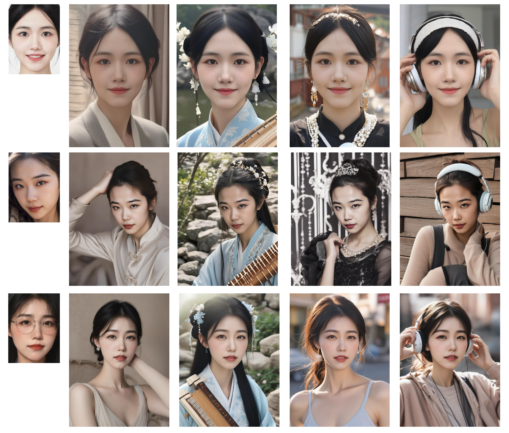

# InstantID
<a href='https://instantid.github.io/'></a> 
<a href='https://arxiv.org/abs/2401.07519'></a> 
<a href='https://huggingface.co/papers/2401.07519'></a> 
<a href='https://huggingface.co/spaces/InstantX/InstantID'></a> 

**InstantID : Zero-shot Identity-Preserving Generation in Seconds**


InstantID represents an excellent tuning-free approach designed for ID-Preserving generation using just a single image. This method supports a variety of downstream tasks, setting a new benchmark in the field.

This repository is an unofficial implementation and a fork from the original InstantID repository(https://github.com/InstantID/InstantID ). **It includes additional training code not found in the original implementation.**

We would like to express our sincere appreciation to the creators of "InstantID: Zero-shot Identity-Preserving Generation in Seconds" for making their innovative work available to the public. **In this repository, we have developed the training code and, after conducting training sessions on our own proprietary dataset, we have successfully reproduced the results demonstrated by the original authors' pretrained model.**


## Demos
To train our model, we use the script `train_instantId_sdxl.sh`. This script is configured to efficiently handle the training process on our specified private dataset.

For inference, we employ the script `infer_from_pkl.py`. This script allows us to perform inference operations using the trained model. Prior to processing, the get_face_info.py script is used to invoke FaceAnalysis, storing relevant facial information in a PKL file.

By following this process, we can achieve impressive results, showcasing the effectiveness of our training and official inference scripts on private datasets.




## Download

You can directly download the model from [Huggingface](https://huggingface.co/InstantX/InstantID).
You also can download the model in python script:

```python
from huggingface_hub import hf_hub_download
hf_hub_download(repo_id="InstantX/InstantID", filename="ControlNetModel/config.json", local_dir="./checkpoints")
hf_hub_download(repo_id="InstantX/InstantID", filename="ControlNetModel/diffusion_pytorch_model.safetensors", local_dir="./checkpoints")
hf_hub_download(repo_id="InstantX/InstantID", filename="ip-adapter.bin", local_dir="./checkpoints")
```

If you cannot access to Huggingface, you can use [hf-mirror](https://hf-mirror.com/) to download models.
```python
export HF_ENDPOINT=https://hf-mirror.com
huggingface-cli download --resume-download InstantX/InstantID --local-dir checkpoints
```

For face encoder, you need to manutally download via this [URL](https://github.com/deepinsight/insightface/issues/1896#issuecomment-1023867304) to `models/antelopev2` as the default link is invalid. Once you have prepared all models, the folder tree should be like:

```
  .
  ├── models
  ├── checkpoints
  ├── ip_adapter
  ├── pipeline_stable_diffusion_xl_instantid.py
  └── README.md
```

## Usage

```python
# !pip install opencv-python transformers accelerate insightface
import diffusers
from diffusers.utils import load_image
from diffusers.models import ControlNetModel

import cv2
import torch
import numpy as np
from PIL import Image

from insightface.app import FaceAnalysis
from pipeline_stable_diffusion_xl_instantid import StableDiffusionXLInstantIDPipeline, draw_kps

# prepare 'antelopev2' under ./models
app = FaceAnalysis(name='antelopev2', root='./', providers=['CUDAExecutionProvider', 'CPUExecutionProvider'])
app.prepare(ctx_id=0, det_size=(640, 640))

# prepare models under ./checkpoints
face_adapter = f'./checkpoints/ip-adapter.bin'
controlnet_path = f'./checkpoints/ControlNetModel'

# load IdentityNet
controlnet = ControlNetModel.from_pretrained(controlnet_path, torch_dtype=torch.float16)

pipe = StableDiffusionXLInstantIDPipeline.from_pretrained(
...     "stabilityai/stable-diffusion-xl-base-1.0", controlnet=controlnet, torch_dtype=torch.float16
... )
pipe.cuda()

# load adapter
pipe.load_ip_adapter_instantid(face_adapter)
```

Then, you can customized your own face images

```python
# load an image
image = load_image("your-example.jpg")

# prepare face emb
face_info = app.get(cv2.cvtColor(np.array(face_image), cv2.COLOR_RGB2BGR))
face_info = sorted(face_info, key=lambda x:(x['bbox'][2]-x['bbox'][0])*x['bbox'][3]-x['bbox'][1])[-1] # only use the maximum face
face_emb = face_info['embedding']
face_kps = draw_kps(face_image, face_info['kps'])

pipe.set_ip_adapter_scale(0.8)

prompt = "analog film photo of a man. faded film, desaturated, 35mm photo, grainy, vignette, vintage, Kodachrome, Lomography, stained, highly detailed, found footage, masterpiece, best quality"
negative_prompt = "(lowres, low quality, worst quality:1.2), (text:1.2), watermark, painting, drawing, illustration, glitch, deformed, mutated, cross-eyed, ugly, disfigured (lowres, low quality, worst quality:1.2), (text:1.2), watermark, painting, drawing, illustration, glitch,deformed, mutated, cross-eyed, ugly, disfigured"

# generate image
image = pipe(
...     prompt, image_embeds=face_emb, image=face_kps, controlnet_conditioning_scale=0.8
... ).images[0]
```

## Usage Tips
1. If you're unsatisfied with the similarity, increase the weight of controlnet_conditioning_scale (IdentityNet) and ip_adapter_scale (Adapter).
2. If the generated image is over-saturated, decrease the ip_adapter_scale. If not work, decrease controlnet_conditioning_scale.
3. If text control is not as expected, decrease ip_adapter_scale.
4. Good base model always makes a difference.

## Disclaimer
This project is released under [Apache License](https://github.com/InstantID/InstantID?tab=Apache-2.0-1-ov-file#readme) and aims to positively impact the field of AI-driven image generation. Users are granted the freedom to create images using this tool, but they are obligated to comply with local laws and utilize it responsibly. The developers will not assume any responsibility for potential misuse by users.

## Main Contributor
chenxinhua: chenxinhua1002@163.com
